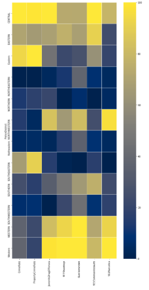
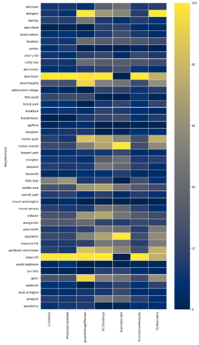
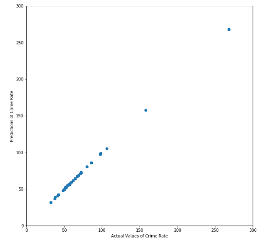
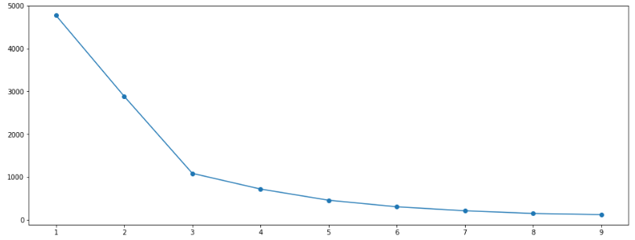
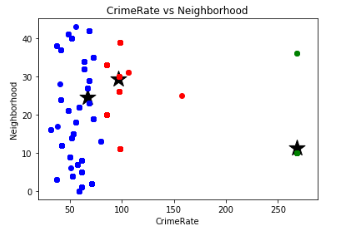

# Baltimore Crime Analysis

## Introduction

Extracting the all the record for Crime Analysis.

## Getting Started

```python
import pandas as pd
import string
import numpy as np
from sklearn import preprocessing
from sklearn.preprocessing import LabelEncoder
import matplotlib.pyplot as plt
import seaborn as sns
from sklearn.cluster import KMeans
from sklearn import metrics
from scipy.spatial.distance import cdist
```

### Calling the crime dataset

```python
crime=pd.read_csv('Crime_and_Safety__2015__data.csv')
```

### calling the vacant homes dataset

```python
vacant=pd.read_csv('vacanthome1.csv')
```

### printing the crime dataset to understand the attributes

```python
crime
```

|     | the_geom                                          | OBJECTID | Community Statistical Areas (CSAs) | Part 1 Crime Rate per 1,000 Residents | Violent Crime Rate per 1,000 Residents | Property Crime Rate per 1,000 Residents | Juvenile Arrest Rate per 1,000 Juveniles | Juvenile Arrest Rate for Violent Offenses per 1,000 Juveniles | Juvenile Arrest Rate for Drug Offenses per 1,000 Juveniles | Rate of 911 Calls for Service for Shootings per 1,000 Residents | Rate of Gun Homicides per 10,000 Residents | Rate of 911 Calls for Service for Common Assaults per 1,000 Residents | Rate of 911 Calls for Service for Narcotics per 1,000 Residents | Rate of 911 Calls for Service for Auto Accidents per 1,000 Residents | Adult Arrest Rate per 1,000 Adults | Shape\_\_Area | Shape\_\_Length |
| --- | ------------------------------------------------- | -------- | ---------------------------------- | ------------------------------------- | -------------------------------------- | --------------------------------------- | ---------------------------------------- | ------------------------------------------------------------- | ---------------------------------------------------------- | --------------------------------------------------------------- | ------------------------------------------ | --------------------------------------------------------------------- | --------------------------------------------------------------- | -------------------------------------------------------------------- | ---------------------------------- | ------------- | --------------- |
| 0   | MULTIPOLYGON (((-76.598249582828 39.3541564623... | 20       | Greater Govans                     | 48.965453                             | 11.328527                              | 37.262429                               | 17.316017                                | 2.597403                                                      | 4.329004                                                   | 3.183223                                                        | 0.748994                                   | 66.473177                                                             | 81.546672                                                       | 47.841962                                                            | 32.581764                          | 2.269850e+07  | 22982.125715    |
| ... | ...                                               | ...      | ...                                | ...                                   | ...                                    | ...                                     | ...                                      | ...                                                           | ...                                                        | ...                                                             | ...                                        | ...                                                                   | ...                                                             | ...                                                                  | ...                                | ...           | ...             |
| 54  | MULTIPOLYGON (((-76.623112211246 39.3109806791... | 40       | Penn North/Reservoir Hill          | 64.232520                             | 15.825403                              | 46.959040                               | 28.484232                                | 8.138352                                                      | 3.051882                                                   | 6.102607                                                        | 0.930906                                   | 77.161771                                                             | 144.807613                                                      | 79.747621                                                            | 35.924054                          | 4.105980e+07  | 29078.838498    |

### Data-preprocessing step - checking for null values

```python
crime.isna().any()
```

```python
the_geom                                                                 False
OBJECTID                                                                 False
Community Statistical Areas (CSAs)                                       False
Part 1 Crime Rate per 1,000 Residents                                    False
Violent Crime Rate per 1,000 Residents                                   False
Property Crime Rate per 1,000 Residents                                  False
Juvenile Arrest Rate per 1,000 Juveniles                                 False
Juvenile Arrest Rate for Violent Offenses per 1,000 Juveniles            False
Juvenile Arrest Rate for Drug Offenses per 1,000 Juveniles               False
Rate of 911 Calls for Service for Shootings per 1,000 Residents          False
Rate of Gun Homicides per 10,000 Residents                               False
Rate of 911 Calls for Service for Common Assaults per 1,000 Residents    False
Rate of 911 Calls for Service for Narcotics per 1,000 Residents          False
Rate of 911 Calls for Service for Auto Accidents per 1,000 Residents     False
Adult Arrest Rate per 1,000 Adults                                       False
Shape__Area                                                              False
Shape__Length                                                            False
dtype: bool
```

### Data Pre-processing step - Rename for convinience

```python
crime.rename(columns={'Part 1 Crime Rate per 1,000 Residents': 'CrimeRate'}, inplace=True)
crime.rename(columns={'Violent Crime Rate per 1,000 Residents': 'ViolentCrimeRate'}, inplace=True)
crime.rename(columns={'Property Crime Rate per 1,000 Residents': 'PropertyCrimeRate'}, inplace=True)
crime.rename(columns={'Juvenile Arrest Rate per 1,000 Juveniles': 'JuvenileArrestRate'}, inplace=True)
crime.rename(columns={'Juvenile Arrest Rate for Violent Offenses per 1,000 Juveniles': 'JuvenileViolentOffenses'}, inplace=True)
crime.rename(columns={'Juvenile Arrest Rate for Drug Offenses per 1,000 Juveniles': 'JuvenileDrugOffenses'}, inplace=True)
crime.rename(columns={'Rate of 911 Calls for Service for Shootings per 1,000 Residents': '911Shootings'}, inplace=True)
crime.rename(columns={'Rate of Gun Homicides per 10,000 Residents': 'GunHomicides'}, inplace=True)
crime.rename(columns={'Rate of 911 Calls for Service for Common Assaults per 1,000 Residents': '911CommonAssaults'}, inplace=True)
crime.rename(columns={'Rate of 911 Calls for Service for Narcotics per 1,000 Residents': '911Narcotics'}, inplace=True)
crime.rename(columns={'Rate of 911 Calls for Service for Auto Accidents per 1,000 Residents': '911AutoAccidents'}, inplace=True)
crime.rename(columns={'Adult Arrest Rate per 1,000 Adults': 'AdultArrestRate'}, inplace=True)
```

### Data Pre-processing step - Dropping the columns which null values

```python
crime.drop(['the_geom', 'OBJECTID', 'Shape__Area', 'Shape__Length'],axis=1, inplace=True)
```

### Printing the crime dataset after the updates

```python
crime.head()
```

|     | Community Statistical Areas (CSAs) | CrimeRate | ViolentCrimeRate | PropertyCrimeRate | JuvenileArrestRate | JuvenileViolentOffenses | JuvenileDrugOffenses | 911Shootings | GunHomicides | 911CommonAssaults | 911Narcotics | 911AutoAccidents | AdultArrestRate |
| --- | ---------------------------------- | --------- | ---------------- | ----------------- | ------------------ | ----------------------- | -------------------- | ------------ | ------------ | ----------------- | ------------ | ---------------- | --------------- |
| 0   | Greater Govans                     | 48.965453 | 11.328527        | 37.262429         | 17.316017          | 2.597403                | 4.329004             | 3.183223     | 0.748994     | 66.473177         | 81.546672    | 47.841962        | 32.581764       |
| ... | ...                                | ...       | ...              | ...               | ...                | ...                     | ...                  | ...          | ...          | ...               | ...          | ...              | ...             | ... |
| 4   | Dorchester/Ashburton               | 50.313932 | 12.557271        | 36.738503         | 10.933558          | 2.523129                | 2.523129             | 2.630239     | 0.593925     | 55.913796         | 23.502461    | 50.229085        | 13.747564       |

### Checking if there are no more null values

```python
crime.isna().any()
```

```python
Community Statistical Areas (CSAs)    False
CrimeRate                             False
ViolentCrimeRate                      False
PropertyCrimeRate                     False
JuvenileArrestRate                    False
JuvenileViolentOffenses               False
JuvenileDrugOffenses                  False
911Shootings                          False
GunHomicides                          False
911CommonAssaults                     False
911Narcotics                          False
911AutoAccidents                      False
AdultArrestRate                       False
dtype: bool
```

### Data Preprocessing step - Splitting the Community column which has two places separated by '/' and then

```python
c = crime['Community Statistical Areas (CSAs)'].str.split('/').apply(pd.Series, 1).stack()
c.index = c.index.droplevel(-1)
c.name = 'Neighborhood'
del crime['Community Statistical Areas (CSAs)']
crime = crime.join(c)
crime=crime.reset_index()
del crime['index']
```

### Making sure the characters match correctly while performing a join

```python
crime['Neighborhood'] = crime['Neighborhood'].str.lower()
```

```python
crime.head()
```

|     | CrimeRate | ViolentCrimeRate | PropertyCrimeRate | JuvenileArrestRate | JuvenileViolentOffenses | JuvenileDrugOffenses | 911Shootings | GunHomicides | 911CommonAssaults | 911Narcotics | 911AutoAccidents | AdultArrestRate | Neighborhood   |
| --- | --------- | ---------------- | ----------------- | ------------------ | ----------------------- | -------------------- | ------------ | ------------ | ----------------- | ------------ | ---------------- | --------------- | -------------- |
| 0   | 48.965453 | 11.328527        | 37.262429         | 17.316017          | 2.597403                | 4.329004             | 3.183223     | 0.748994     | 66.473177         | 81.546672    | 47.841962        | 32.581764       | greater govans |
| ... | ...       | ...              | ...               | ...                | ...                     | ...                  | ...          | ...          | ...               | ...          | ...              | ...             | ...            | ... |
| 4   | 72.435553 | 26.114393        | 44.978518         | 53.972104          | 10.309278               | 14.554275            | 9.667025     | 1.208378     | 116.071429        | 220.797530   | 76.194952        | 72.268452       | harlem park    |

```python
crime.shape[0]
96
```

### Data Exploratory Step - Understanding the vacant home dataset

```python
vacant['Neighborhood'].value_counts()
```

#### Output

```
BROADWAY EAST                      749
CARROLLTON RIDGE                   515
SANDTOWN-WINCHESTER                481
HARLEM PARK                        453
CENTRAL PARK HEIGHTS               367
UPTON                              260
PARKVIEW/WOODBROOK                  83
                                  ...

FOUR BY FOUR                         1
LAURAVILLE                           1
BURLEITH-LEIGHTON                    1
WALTHERSON                           1
GUILFORD                             1
LOCUST POINT                         1
Hamilton Hills                       1
Name: Neighborhood, Length: 179, dtype: int64
```

### Data Pre-processing step - dropping the columns which will not be used for the project

```python
vacant.drop(['ReferenceID','Block','Lot','NoticeDate'],axis=1, inplace=True)
```

### Making sure the characters match correctly while performing a join

```python
vacant['Neighborhood'] = vacant['Neighborhood'].str.lower()
```

### Printing the crime dataset after the updates

```python
vacant
```

|      | BuildingAddress          | Neighborhood | PoliceDistrict | CouncilDistrict | Latitude  | Longitude  |
| ---- | ------------------------ | ------------ | -------------- | --------------- | --------- | ---------- |
| 0    | 1945 W NORTH AVE         | easterwood   | WESTERN        | 7               | 39.309473 | -76.649536 |
| ...  | ...                      | ...          | ...            | ...             | ...       | ...        |
| 8877 | 5112 N FRANKLINTOWN ROAD | franklintown | SOUTHWESTERN   | 8               | 39.303825 | -76.709725 |

8878 rows × 6 columns

### Checking if there are no more null values

```python
vacant.isna().any()
```

```python
BuildingAddress    False
Neighborhood       False
PoliceDistrict     False
CouncilDistrict    False
Latitude           False
Longitude          False
dtype: bool
```

### Joining the datasets based on Neighborhood attribute

```python
final = pd.merge(crime, vacant, on = 'Neighborhood')
final
final
```

|      | CrimeRate | ViolentCrimeRate | PropertyCrimeRate | JuvenileArrestRate | JuvenileViolentOffenses | JuvenileDrugOffenses | 911Shootings | GunHomicides | 911CommonAssaults | 911Narcotics | 911AutoAccidents | AdultArrestRate | Neighborhood        | BuildingAddress  | PoliceDistrict | CouncilDistrict | Latitude  | Longitude  |
| ---- | --------- | ---------------- | ----------------- | ------------------ | ----------------------- | -------------------- | ------------ | ------------ | ----------------- | ------------ | ---------------- | --------------- | ------------------- | ---------------- | -------------- | --------------- | --------- | ---------- |
| 0    | 72.435553 | 26.114393        | 44.978518         | 53.972104          | 10.309278               | 14.554275            | 9.667025     | 1.208378     | 116.071429        | 220.797530   | 76.194952        | 72.268452       | sandtown-winchester | 1807 W NORTH AVE | WESTERN        | 7               | 39.309628 | -76.646765 |
| ...  | ...       | ...              | ...               | ...                | ...                     | ...                  | ...          | ...          | ...               | ...          | ...              | ...             | ...                 | ...              |
| 2384 | 64.232520 | 15.825403        | 46.959040         | 28.484232          | 8.138352                | 3.051882             | 6.102607     | 0.930906     | 77.161771         | 144.807613   | 79.747621        | 35.924054       | reservoir hill      | 916 WHITELOCK ST | CENTRAL        | 7               | 39.314631 | -76.633180 |

2385 rows × 18 columns

### Exploratory Analysis - Plotted a heat map to understand the crime with respect to district

```python
neighbor_heatmap = final[['PoliceDistrict', 'CrimeRate',
       'PropertyCrimeRate',        'JuvenileDrugOffenses', '911Shootings', 'GunHomicides',
       '911CommonAssaults', '911Narcotics']]

neighbor_heatmap = neighbor_heatmap.groupby('PoliceDistrict').mean()

neighbor_heatmap_cpy = neighbor_heatmap.copy()

col_names2 = ['CrimeRate',
       'PropertyCrimeRate',        'JuvenileDrugOffenses', '911Shootings', 'GunHomicides',
       '911CommonAssaults', '911Narcotics']

features2 = neighbor_heatmap[col_names2]

min_max_scaler = preprocessing.MinMaxScaler(feature_range=(0,100))

scaler2 = min_max_scaler.fit(features2)

features2=scaler2.transform(features2)

neighbor_heatmap_cpy[col_names2]= features2

fig, ax = plt.subplots(figsize=(10,20))

sns.heatmap(neighbor_heatmap_cpy, cmap='cividis', linewidths=0.05,ax=ax)

plt.show()
```

#### Output



### Exploratory Analysis - Plotted a heat map to understand the crime with respect to neighbhorhood

```python
neighbor_heatmap = final[['Neighborhood', 'CrimeRate',
       'PropertyCrimeRate',        'JuvenileDrugOffenses', '911Shootings', 'GunHomicides',
       '911CommonAssaults', '911Narcotics']]

neighbor_heatmap = neighbor_heatmap.groupby('Neighborhood').mean()

neighbor_heatmap_cpy = neighbor_heatmap.copy()

col_names2 = ['CrimeRate',
       'PropertyCrimeRate',        'JuvenileDrugOffenses', '911Shootings', 'GunHomicides',
       '911CommonAssaults', '911Narcotics']

features2 = neighbor_heatmap[col_names2]

min_max_scaler = preprocessing.MinMaxScaler(feature_range=(0,100))

scaler2 = min_max_scaler.fit(features2)

features2=scaler2.transform(features2)

neighbor_heatmap_cpy[col_names2]= features2

fig, ax = plt.subplots(figsize=(10,20))

sns.heatmap(neighbor_heatmap_cpy, cmap='cividis', linewidths=0.05,ax=ax)

plt.show()
```

#### Output



### Data Preprocessing - assigning numeric values which allows us to apply machine learning models

```python
from sklearn.preprocessing import LabelEncoder
LE = LabelEncoder()
final['Neighborhood'] = LE.fit_transform(final['Neighborhood'])
final['PoliceDistrict'] = LE.fit_transform(final['PoliceDistrict'])
final['BuildingAddress'] = LE.fit_transform(final['BuildingAddress'])
```

### output after label encoder is implemented

```python
final.head()
```

|     | CrimeRate | ViolentCrimeRate | PropertyCrimeRate | JuvenileArrestRate | JuvenileViolentOffenses | JuvenileDrugOffenses | 911Shootings | GunHomicides | 911CommonAssaults | 911Narcotics | 911AutoAccidents | AdultArrestRate | Neighborhood | BuildingAddress | PoliceDistrict | CouncilDistrict | Latitude  | Longitude  |
| --- | --------- | ---------------- | ----------------- | ------------------ | ----------------------- | -------------------- | ------------ | ------------ | ----------------- | ------------ | ---------------- | --------------- | ------------ | --------------- | -------------- | --------------- | --------- | ---------- |
| 0   | 72.435553 | 26.114393        | 44.978518         | 53.972104          | 10.309278               | 14.554275            | 9.667025     | 1.208378     | 116.071429        | 220.79753    | 76.194952        | 72.268452       | 35           | 826             | 10             | 7               | 39.309628 | -76.646765 |
| ... | ...       | ...              | ...               | ...                | ...                     | ...                  | ...          | ...          | ...               | ...          | ...              | ...             | ...          | ...             |
| 4   | 72.435553 | 26.114393        | 44.978518         | 53.972104          | 10.309278               | 14.554275            | 9.667025     | 1.208378     | 116.071429        | 220.79753    | 76.194952        | 72.268452       | 35           | 902             | 10             | 7               | 39.309585 | -76.647336 |

### implementing linear regression

```python
from sklearn.model_selection import train_test_split
x = final.drop(['CrimeRate'],axis=1)
y = final['CrimeRate']
from sklearn import linear_model
x_train, x_test, y_train, y_test = train_test_split(x, y, test_size=0.2,random_state=42)
lm = linear_model.LinearRegression()
model=lm.fit(x_train,y_train)
predictions=lm.predict(x_train)
plt.figure(figsize=(10, 10))
plt.scatter(y_train, predictions)
plt.xlabel('Actual Values of Crime Rate')
plt.ylabel('Predictions of Crime Rate')
plt.xlim(0, 300)
plt.ylim(0, 300)
plt.show()
```



```python
from sklearn import metrics
rms=np.sqrt(metrics.mean_squared_error(y_train, predictions))
```

### calculating root mean square error

```python
rms
```

#### Output

0.13086185933064995

### calculating the accuracy of the model

```python
errors = abs(predictions - y_train)
mape = 100 \* (errors / y_train)
accuracy = 100 - np.mean(mape)
print('Accuracy:', round(accuracy, 2), '%.')
```

#### Output

Accuracy: 99.87 %.

```python
x_train[0:5]

```

|      | ViolentCrimeRate | PropertyCrimeRate | JuvenileArrestRate | JuvenileViolentOffenses | JuvenileDrugOffenses | 911Shootings | GunHomicides | 911CommonAssaults | 911Narcotics | 911AutoAccidents | AdultArrestRate | Neighborhood | BuildingAddress | PoliceDistrict | CouncilDistrict | Latitude  | Longitude  |
| ---- | ---------------- | ----------------- | ------------------ | ----------------------- | -------------------- | ------------ | ------------ | ----------------- | ------------ | ---------------- | --------------- | ------------ | --------------- | -------------- | --------------- | --------- | ---------- |
| 275  | 26.114393        | 44.978518         | 53.972104          | 10.309278               | 14.554275            | 9.667025     | 1.208378     | 116.071429        | 220.797530   | 76.194952        | 72.268452       | 35           | 375             | 10             | 9               | 39.299836 | -76.639660 |
| ...  | ...              | ...               | ...                | ...                     | ...                  | ...          | ...          | ...               | ...          | ...              | ...             | ...          | ...             | ...            |
| 1711 | 30.264939        | 66.718236         | 71.992976          | 14.925373               | 15.803336            | 6.768517     | 0.966931     | 109.649971        | 175.401276   | 74.453684        | 69.323144       | 39           | 2146            | 0              | 11              | 39.296348 | -76.631368 |

```python
y_train[0:5]
```

#### Output

```python
275           72.435553
2107          61.644317
1406          67.045962
360           72.435553
1711          98.336879
Name: CrimeRate, dtype: float64
```

```python
predictions[0:5].tolist()
```

#### Output

[72.4553458293416,
61.63029975502762,
67.37324848098874,
72.40258274909624,
98.27466457270418]

### implementing K-Means Clustering

```python
from sklearn.cluster import KMeans
X = final[['CrimeRate', 'Neighborhood']]

from sklearn.preprocessing import StandardScaler
scaler = StandardScaler()
X_scaled = scaler.fit_transform( X )
cluster_range = range( 1, 10 )
cluster_errors = []
```

#### calculating the k value using elbow method

```python
for num_clusters in cluster_range:
  clusters = KMeans( num_clusters )
  clusters.fit( X_scaled )
  cluster_errors.append( clusters.inertia_ )

clusters_df = pd.DataFrame( { "num_clusters":cluster_range, "cluster_errors": cluster_errors } )

clusters_df[0:10]
plt.figure(figsize=(16,6))
plt.plot( clusters_df.num_clusters, clusters_df.cluster_errors, marker = "o" );
```



```python
plt.plot()
x1=final['CrimeRate']
x2=final['Neighborhood']
X = np.array(list(zip(x1, x2))).reshape(len(x1), 2)
colors = ['blue', 'green', 'red']

kmeans*model = KMeans(n_clusters=3).fit(X)
centers = np.array(kmeans_model.cluster_centers*)

plt.title('CrimeRate vs Neighborhood')
plt.xlabel('CrimeRate')
plt.ylabel('Neighborhood')

for i, l in enumerate(kmeans*model.labels*):
plt.plot(x1[i], x2[i], color=colors[l], marker= 'o')

plt.scatter(centers[:,0],centers[:,1], marker='\*', color='black', s=400)

plt.show()
```


