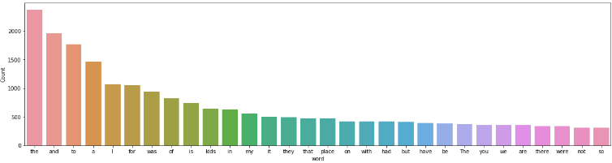
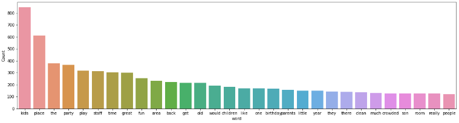
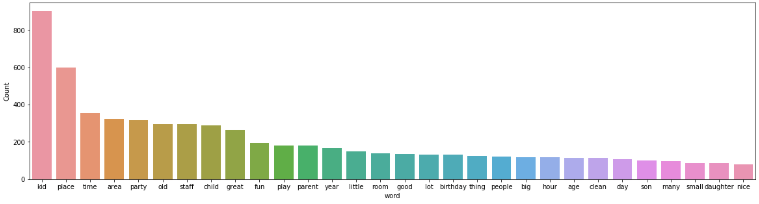
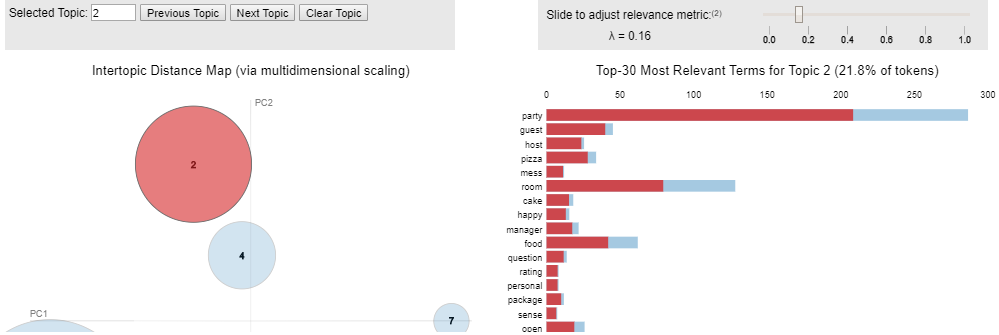
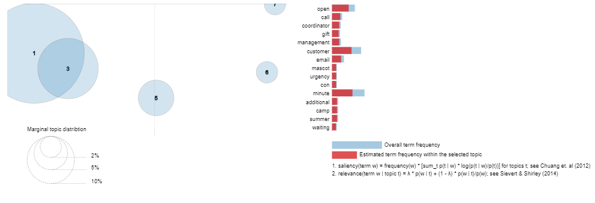

## Reviews Analysis using Topic Modeling

Topic modelling can be described as a method for finding a group of words (i.e topic) from a collection of documents that best represents the information in the collection.In machine learning and natural language processing, a topic model is a type of statistical model for discovering the abstract "topics" that occur in a collection of documents. Topic modeling is a frequently used text-mining tool for discovery of hidden semantic structures in a text body.

## Getting Started

### importing nltk libraries

```python
import nltk
from nltk import FreqDist
```

### downlaoding only stopwords as it takes a very long time download all the items in nltk, run this one time.

```python
nltk.download('stopwords')
```

### Installing pip

```python
!python -m pip install -U gensim
```

```
Requirement already up-to-date: gensim in c:\users\kusam\anaconda3\lib\site-packages (3.8.3)
Requirement already satisfied, skipping upgrade: Cython==0.29.14 in c:\users\kusam\anaconda3\lib\site-packages (from gensim) (0.29.14)
Requirement already satisfied, skipping upgrade: six>=1.5.0 in c:\users\kusam\anaconda3\lib\site-packages (from gensim) (1.12.0)
Requirement already satisfied, skipping upgrade: scipy>=0.18.1 in c:\users\kusam\anaconda3\lib\site-packages (from gensim) (1.3.1)
Requirement already satisfied, skipping upgrade: numpy>=1.11.3 in c:\users\kusam\anaconda3\lib\site-packages (from gensim) (1.16.5)
Requirement already satisfied, skipping upgrade: smart-open>=1.8.1 in c:\users\kusam\anaconda3\lib\site-packages (from gensim) (2.0.0)
Requirement already satisfied, skipping upgrade: requests in c:\users\kusam\anaconda3\lib\site-packages (from smart-open>=1.8.1->gensim) (2.22.0)
Requirement already satisfied, skipping upgrade: boto in c:\users\kusam\anaconda3\lib\site-packages (from smart-open>=1.8.1->gensim) (2.49.0)
Requirement already satisfied, skipping upgrade: boto3 in c:\users\kusam\anaconda3\lib\site-packages (from smart-open>=1.8.1->gensim) (1.13.16)
Requirement already satisfied, skipping upgrade: chardet<3.1.0,>=3.0.2 in c:\users\kusam\anaconda3\lib\site-packages (from requests->smart-open>=1.8.1->gensim) (3.0.4)
Requirement already satisfied, skipping upgrade: certifi>=2017.4.17 in c:\users\kusam\anaconda3\lib\site-packages (from requests->smart-open>=1.8.1->gensim) (2019.9.11)
Requirement already satisfied, skipping upgrade: idna<2.9,>=2.5 in c:\users\kusam\anaconda3\lib\site-packages (from requests->smart-open>=1.8.1->gensim) (2.8)
Requirement already satisfied, skipping upgrade: urllib3!=1.25.0,!=1.25.1,<1.26,>=1.21.1 in c:\users\kusam\anaconda3\lib\site-packages (from requests->smart-open>=1.8.1->gensim) (1.24.2)
Requirement already satisfied, skipping upgrade: s3transfer<0.4.0,>=0.3.0 in c:\users\kusam\anaconda3\lib\site-packages (from boto3->smart-open>=1.8.1->gensim) (0.3.3)
Requirement already satisfied, skipping upgrade: botocore<1.17.0,>=1.16.16 in c:\users\kusam\anaconda3\lib\site-packages (from boto3->smart-open>=1.8.1->gensim) (1.16.16)
Requirement already satisfied, skipping upgrade: jmespath<1.0.0,>=0.7.1 in c:\users\kusam\anaconda3\lib\site-packages (from boto3->smart-open>=1.8.1->gensim) (0.10.0)
Requirement already satisfied, skipping upgrade: docutils<0.16,>=0.10 in c:\users\kusam\anaconda3\lib\site-packages (from botocore<1.17.0,>=1.16.16->boto3->smart-open>=1.8.1->gensim) (0.15.2)
Requirement already satisfied, skipping upgrade: python-dateutil<3.0.0,>=2.1 in c:\users\kusam\anaconda3\lib\site-packages (from botocore<1.17.0,>=1.16.16->boto3->smart-open>=1.8.1->gensim) (2.8.0)
```

### Installing conda

```python
conda install -c conda-forge pyldavis
```

#### Output

```
Collecting package metadata (current_repodata.json): ...working... done
Solving environment: ...working... done

# All requested packages already installed.

Note: you may need to restart the kernel to use updated packages.
```

### Importing libraries

```python
import pandas as pd
pd.set_option("display.max_colwidth", 200)
import numpy as np
import re
import spacy

# to perform topic modeling(LDA method)
import gensim
from gensim import corpora

# libraries for visualization
import pyLDAvis
import pyLDAvis.gensim
import matplotlib.pyplot as plt
import seaborn as sns
%matplotlib inline
```

### Reading the reviews csv file obtained from Kaggle

```python
#change the file name
df = pd.read_csv('HK_Reviews.csv', header = 1)
df.head()
```

| s.no | Media  | Reviewer Name              | Reviews                                                                                                                                                                                                 | Rating | Response from the Owner                                                                                                                                                                                | Comment          | Safety | Sanity | Customer Service | Party | Unnamed: 11 | Unnamed: 12                                                                                                                                       |
| ---- | ------ | -------------------------- | ------------------------------------------------------------------------------------------------------------------------------------------------------------------------------------------------------- | ------ | ------------------------------------------------------------------------------------------------------------------------------------------------------------------------------------------------------ | ---------------- | ------ | ------ | ---------------- | ----- | ----------- | ------------------------------------------------------------------------------------------------------------------------------------------------- |
| 1    | Yelp   | Jessie L.\r\nBaltimore, MD | For those of you not aware, there is a recent occurrence on 4/9/18 with Hyper Kidz that is causing me to regret the purchase of a two-visit CertifiKID voucher. In summary, a mother complained tha...  | 1      | 4/12/2018 Jessica, incident as you describe it here (and on many other social media platforms) is a falsehood. In speaking with the mother personally, she stated that she was never told that she ... | NaN              | NaN    | NaN    | NaN              | NaN   | NaN         | I have booked a March birthday party for my two girls, one will be turning 1y.o. and the other 7y.o. So far, the event planner, Skylar, has be... |
| ...  | ...    | ...                        | ...                                                                                                                                                                                                     | ...    | ...                                                                                                                                                                                                    | ...              | ...    | ...    | ...              | ...   | ...         | ...                                                                                                                                               |
| 5    | Google | Ruth Ann Healey            | The place was horrible! It was way over crowded. It was hard to even find the place or parking. It was too expensive. The party room was small and it was extremely hot with nowhere for adults to s... | 1 star | Hi Ruth,\nI’m sorry about your experience at Hyper Kidz. Great news we are expanding. Yes weekends do get busy for various reason. Have a wonderful day.                                               | Capacity & Price | NaN    | NaN    | NaN              | NaN   | NaN         | NaN                                                                                                                                               |

### Finding out the length of the dataset

```python
len(df)
```

#### Output

```
880
```

### Data Preprocessing - identifying null values

```python
df.isna().any()
```

#### Output

|                         |       |
| ----------------------- | ----- |
| s.no                    | False |
| Media                   | False |
| Reviewer Name           | True  |
| Reviews                 | True  |
| Rating                  | False |
| Response from the Owner | True  |
| Comment                 | True  |
| Safety                  | True  |
| Sanity                  | True  |
| Customer Service        | True  |
| Party                   | True  |
| Unnamed: 11             | True  |
| Unnamed: 12             | True  |
| dtype:                  | bool  |

### Droping the rows which have no reviews

```python
df = df[df['Reviews'].notna()]
df.head()
```

| s.no | Media  | Reviewer Name              | Reviews                                                                                                                                                                                                 | Rating | Response from the Owner                                                                                                                                                                                | Comment          | Safety | Sanity | Customer Service | Party | Unnamed: 11 | Unnamed: 12                                                                                                                                       |
| ---- | ------ | -------------------------- | ------------------------------------------------------------------------------------------------------------------------------------------------------------------------------------------------------- | ------ | ------------------------------------------------------------------------------------------------------------------------------------------------------------------------------------------------------ | ---------------- | ------ | ------ | ---------------- | ----- | ----------- | ------------------------------------------------------------------------------------------------------------------------------------------------- |
| 1    | Yelp   | Jessie L.\r\nBaltimore, MD | For those of you not aware, there is a recent occurrence on 4/9/18 with Hyper Kidz that is causing me to regret the purchase of a two-visit CertifiKID voucher. In summary, a mother complained tha...  | 1      | 4/12/2018 Jessica, incident as you describe it here (and on many other social media platforms) is a falsehood. In speaking with the mother personally, she stated that she was never told that she ... | NaN              | NaN    | NaN    | NaN              | NaN   | NaN         | I have booked a March birthday party for my two girls, one will be turning 1y.o. and the other 7y.o. So far, the event planner, Skylar, has be... |
| ...  | ...    | ...                        | ...                                                                                                                                                                                                     | ...    | ...                                                                                                                                                                                                    | ...              | ...    | ...    | ...              | ...   | ...         | ...                                                                                                                                               |
| 5    | Google | Ruth Ann Healey            | The place was horrible! It was way over crowded. It was hard to even find the place or parking. It was too expensive. The party room was small and it was extremely hot with nowhere for adults to s... | 1 star | Hi Ruth,\nI’m sorry about your experience at Hyper Kidz. Great news we are expanding. Yes weekends do get busy for various reason. Have a wonderful day.                                               | Capacity & Price | NaN    | NaN    | NaN              | NaN   | NaN         | NaN                                                                                                                                               |

### Finding out the length of the dataset after dropping the rows

```python
len(df)
```

#### Output

```
875
```

### Verifying if there are any null values in reviews column

```python
df.isna().any()
```

#### Output

|                         |       |
| ----------------------- | ----- |
| s.no                    | False |
| Media                   | False |
| Reviewer Name           | Fasle |
| Reviews                 | False |
| Rating                  | False |
| Response from the Owner | True  |
| Comment                 | True  |
| Safety                  | True  |
| Sanity                  | True  |
| Customer Service        | True  |
| Party                   | True  |
| Unnamed: 11             | True  |
| Unnamed: 12             | True  |
| dtype:                  | bool  |

### Data-Preprocessing - dropping unwanted columns

```python
df.drop(['Comment','Safety','Sanity','Customer Service', 'Party', 'Unnamed: 11', 'Unnamed: 12'],axis=1, inplace=True)
```

```
df.head()
```

| s.no | Media  | Reviewer Name              | Reviews                                                                                                                                                                                                 | Rating | Response from the Owner                                                                                                                                                                                |
| ---- | ------ | -------------------------- | ------------------------------------------------------------------------------------------------------------------------------------------------------------------------------------------------------- | ------ | ------------------------------------------------------------------------------------------------------------------------------------------------------------------------------------------------------ |
| 1    | Yelp   | Jessie L.\r\nBaltimore, MD | For those of you not aware, there is a recent occurrence on 4/9/18 with Hyper Kidz that is causing me to regret the purchase of a two-visit CertifiKID voucher. In summary, a mother complained tha...  | 1      | 4/12/2018 Jessica, incident as you describe it here (and on many other social media platforms) is a falsehood. In speaking with the mother personally, she stated that she was never told that she ... |
| ...  | ...    | ...                        | ...                                                                                                                                                                                                     | ...    | ...                                                                                                                                                                                                    | ... |
| 5    | Google | Ruth Ann Healey            | The place was horrible! It was way over crowded. It was hard to even find the place or parking. It was too expensive. The party room was small and it was extremely hot with nowhere for adults to s... | 1 star | Hi Ruth,\nI’m sorry about your experience at Hyper Kidz. Great news we are expanding. Yes weekends do get busy for various reason. Have a wonderful day.                                               |

### function to plot most frequent terms

```python
    def freq_words(x, terms = 30):
    every_word = ' '.join([text for text in x])
    every_words = every_word.split()

    #to count number of times each word is repeated
    fdist = FreqDist(every_words)
    words_df = pd.DataFrame({'word':list(fdist.keys()), 'count':list(fdist.values())})

    # selecting top 20 most frequent words
    top_20 = words_df.nlargest(columns="count", n = terms)
    plt.figure(figsize=(20,5))
    ax = sns.barplot(data=top_20, x= "word", y = "count")
    ax.set(ylabel = 'Count')
    plt.show()
```

### Plotting the most frequent words

```python
freq_words(df['Reviews'])
```



### remove unwanted characters, numbers and symbols

```python
df['Reviews'] = df['Reviews'].str.replace("[^a-za-z#]", " ")
```

```python
from nltk.corpus import stopwords
#to remove terms like her, she, them, etc
stop_words = stopwords.words('english')
```

```python
# function to remove stopwords
def remove_stopwords(rev):
    rev_new = " ".join([i for i in rev if i not in stop_words])
    return rev_new

# remove short words (length < 3)
df['Reviews'] = df['Reviews'].apply(lambda x: ' '.join([w for w in x.split() if len(w)>2]))

# remove stopwords from the text
reviews = [remove_stopwords(r.split()) for r in df['Reviews']]

# make entire text lowercase
reviews = [r.lower() for r in reviews]

freq_words(reviews)
```



```python
!python -m spacy download en
```

```python
Requirement already satisfied: en_core_web_sm==2.2.5 from https://github.com/explosion/spacy-models/releases/download/en_core_web_sm-2.2.5/en_core_web_sm-2.2.5.tar.gz#egg=en_core_web_sm==2.2.5 in c:\users\kusam\anaconda3\lib\site-packages (2.2.5)
Requirement already satisfied: spacy>=2.2.2 in c:\users\kusam\anaconda3\lib\site-packages (from en_core_web_sm==2.2.5) (2.2.4)
Requirement already satisfied: srsly<1.1.0,>=1.0.2 in c:\users\kusam\anaconda3\lib\site-packages (from spacy>=2.2.2->en_core_web_sm==2.2.5) (1.0.2)
Requirement already satisfied: setuptools in c:\users\kusam\anaconda3\lib\site-packages (from spacy>=2.2.2->en_core_web_sm==2.2.5) (41.4.0)
Requirement already satisfied: requests<3.0.0,>=2.13.0 in c:\users\kusam\anaconda3\lib\site-packages (from spacy>=2.2.2->en_core_web_sm==2.2.5) (2.22.0)
Requirement already satisfied: cymem<2.1.0,>=2.0.2 in c:\users\kusam\anaconda3\lib\site-packages (from spacy>=2.2.2->en_core_web_sm==2.2.5) (2.0.3)
Requirement already satisfied: tqdm<5.0.0,>=4.38.0 in c:\users\kusam\anaconda3\lib\site-packages (from spacy>=2.2.2->en_core_web_sm==2.2.5) (4.46.0)
Requirement already satisfied: thinc==7.4.0 in c:\users\kusam\anaconda3\lib\site-packages (from spacy>=2.2.2->en_core_web_sm==2.2.5) (7.4.0)
Requirement already satisfied: plac<1.2.0,>=0.9.6 in c:\users\kusam\anaconda3\lib\site-packages (from spacy>=2.2.2->en_core_web_sm==2.2.5) (1.1.3)
Requirement already satisfied: preshed<3.1.0,>=3.0.2 in c:\users\kusam\anaconda3\lib\site-packages (from spacy>=2.2.2->en_core_web_sm==2.2.5) (3.0.2)
Requirement already satisfied: numpy>=1.15.0 in c:\users\kusam\anaconda3\lib\site-packages (from spacy>=2.2.2->en_core_web_sm==2.2.5) (1.16.5)
Requirement already satisfied: murmurhash<1.1.0,>=0.28.0 in c:\users\kusam\anaconda3\lib\site-packages (from spacy>=2.2.2->en_core_web_sm==2.2.5) (1.0.2)
Requirement already satisfied: catalogue<1.1.0,>=0.0.7 in c:\users\kusam\anaconda3\lib\site-packages (from spacy>=2.2.2->en_core_web_sm==2.2.5) (1.0.0)
Requirement already satisfied: wasabi<1.1.0,>=0.4.0 in c:\users\kusam\anaconda3\lib\site-packages (from spacy>=2.2.2->en_core_web_sm==2.2.5) (0.6.0)
Requirement already satisfied: blis<0.5.0,>=0.4.0 in c:\users\kusam\anaconda3\lib\site-packages (from spacy>=2.2.2->en_core_web_sm==2.2.5) (0.4.1)
Requirement already satisfied: chardet<3.1.0,>=3.0.2 in c:\users\kusam\anaconda3\lib\site-packages (from requests<3.0.0,>=2.13.0->spacy>=2.2.2->en_core_web_sm==2.2.5) (3.0.4)
Requirement already satisfied: idna<2.9,>=2.5 in c:\users\kusam\anaconda3\lib\site-packages (from requests<3.0.0,>=2.13.0->spacy>=2.2.2->en_core_web_sm==2.2.5) (2.8)
Requirement already satisfied: certifi>=2017.4.17 in c:\users\kusam\anaconda3\lib\site-packages (from requests<3.0.0,>=2.13.0->spacy>=2.2.2->en_core_web_sm==2.2.5) (2019.9.11)
Requirement already satisfied: urllib3!=1.25.0,!=1.25.1,<1.26,>=1.21.1 in c:\users\kusam\anaconda3\lib\site-packages (from requests<3.0.0,>=2.13.0->spacy>=2.2.2->en_core_web_sm==2.2.5) (1.24.2)
Requirement already satisfied: importlib-metadata>=0.20; python_version < "3.8" in c:\users\kusam\anaconda3\lib\site-packages (from catalogue<1.1.0,>=0.0.7->spacy>=2.2.2->en_core_web_sm==2.2.5) (0.23)
Requirement already satisfied: zipp>=0.5 in c:\users\kusam\anaconda3\lib\site-packages (from importlib-metadata>=0.20; python_version < "3.8"->catalogue<1.1.0,>=0.0.7->spacy>=2.2.2->en_core_web_sm==2.2.5) (0.6.0)
Requirement already satisfied: more-itertools in c:\users\kusam\anaconda3\lib\site-packages (from zipp>=0.5->importlib-metadata>=0.20; python_version < "3.8"->catalogue<1.1.0,>=0.0.7->spacy>=2.2.2->en_core_web_sm==2.2.5) (7.2.0)
symbolic link created for C:\Users\kusam\Anaconda3\lib\site-packages\spacy\data\en <<===>> C:\Users\kusam\Anaconda3\lib\site-packages\en_core_web_sm
[+] Download and installation successful
You can now load the model via spacy.load('en_core_web_sm')
[+] Linking successful
C:\Users\kusam\Anaconda3\lib\site-packages\en_core_web_sm -->
C:\Users\kusam\Anaconda3\lib\site-packages\spacy\data\en
You can now load the model via spacy.load('en')
```

```python
nlp = spacy.load('en', disable=['parser', 'ner'])

def lemmatization(texts, tags=['NOUN', 'ADJ']): # filter noun and adjective
    output = []
    for sent in texts:
        doc = nlp(" ".join(sent))
        output.append([token.lemma_ for token in doc if token.pos_ in tags])
        return output
```

```python
#splitting each review into a separate term
tokenized_reviews = pd.Series(reviews).apply(lambda x: x.split())
print(tokenized_reviews[1])
```

#### Output

```python
['what', 'racial', 'discriminating', 'place', 'basically', 'jewish', 'anything', 'want', 'bring', 'whole', 'lot', 'outside', 'food', 'sit', 'table', 'enjoy', 'meal', 'tell', 'customers', 'eat', 'inside', 'bag', 'chips', 'fine', 'hehe', 'older', 'jewish', 'kids', 'like', 'jump', 'water', 'pad', 'zone', 'told', 'stop', 'bunch', 'older', 'kids', 'play', 'zone', 'kicked', 'son', 'even', 'use', 'rotating', 'facility', 'sphere', 'throw', 'son', 'head', 'right', 'way', 'got', 'told', 'son', 'spitting', 'mean', 'bully', 'old', 'son', 'anything', 'fight', 'back', 'speechless', 'shameful']
```

```python
lemm_reviews = lemmatization(tokenized_reviews)
print(lemm_reviews[1])
# print lemmatized review
```

```python
['racial', 'place', 'jewish', 'whole', 'lot', 'food', 'sit', 'table', 'enjoy', 'meal', 'customer', 'bag', 'chip', 'fine', 'old', 'jewish', 'kid', 'jump', 'water', 'pad', 'zone', 'old', 'kid', 'zone', 'son', 'facility', 'sphere', 'son', 'right', 'way', 'son', 'old', 'speechless', 'shameful']
```

```python
reviews_final = []
for i in range(len(lemm_reviews)):
    reviews_final.append(' '.join(lemm_reviews[i]))

df['reviews'] = reviews_final

#printing the count of the words after data cleaning
freq_words(df['reviews'])
```



### Assigning unique integers to each word

```python
dictionary = corpora.Dictionary(lemm_reviews)
print(dictionary)
```

#### Output

```python
Dictionary(2022 unique tokens: ['abuse', 'aware', 'certifikid', 'complaint', 'illegal']...)
```

### Converting it to list of (token_id, token_count)

```python
doc_term_matrix = [dictionary.doc2bow(rev) for rev in lemm_reviews]
print(doc_term_matrix)
```

#### Output

```python
[[(0, 1), (1, 1), (2, 1), (3, 1), (4, 1), (5, 1), (6, 1), (7, 2), (8, 1), (9, 1), (10, 1), (11, 1), (12, 1), (13, 1), (14, 1), (15, 1), (16, 1), (17, 2), (18, 1), (19, 3), (20, 1), (21, 1), (22, 1), (23, 1), (24, 1), (25, 1), (26, 1)], [(27, 1), (28, 1), (29, 1), (30, 1), (31, 1), (32, 1), (33, 1), (34, 2), (35, 1), (36, 2), (37, 1), (38, 1), (39, 3), (40, 1), (41, 1), (42, 1), (43, 1), (44, 1), (45, 1), (46, 3), (47, 1), (48, 1), (49, 1), (50, 1), (51, 1), (52, 1), (53, 2)], [(29, 2), (54, 1), (55, 1), (56, 1), (57, 1), (58, 3), (59, 1), (60, 1), (61, 1), (62, 1), (63, 1), (64, 2), (65, 1), (66, 1), (67, 1), (68, 1), (69, 1), (70, 1), (71, 2), (72, 1), (73, 3), (74, 2), (75, 1), (76, 1), (77, 2), (78, 2), (79, 1), (80, 1), (81, 2), (82, 1), (83, 1), (84, 2), (85, 2), (86, 2),
....
 (2015, 1), (2016, 1), (2017, 2)], [(36, 2), (41, 1), (46, 2), (86, 1), (87, 3), (88, 4), (99, 4), (105, 1), (120, 1), (127, 3), (164, 2), (176, 1), (186, 1), (187, 1), (201, 4), (211, 2), (214, 1), (230, 1), (238, 1), (276, 1), (300, 1), (332, 1), (352, 1), (368, 1), (376, 1), (392, 1), (396, 1), (479, 1), (560, 1), (571, 1), (584, 1), (616, 1), (667, 1), (715, 1), (1010, 1), (1045, 1), (1347, 1), (1798, 1), (1840, 1), (2018, 1)], [(5, 1), (18, 2), (39, 2), (87, 2), (88, 1), (98, 3), (105, 1), (127, 1), (147, 1), (185, 1), (201, 1), (213, 1), (238, 3), (315, 1), (339, 1), (412, 1), (428, 1), (569, 1), (605, 1), (702, 1), (1180, 1), (1211, 1), (1378, 1), (2019, 1), (2020, 1), (2021, 1)], [(36, 2), (46, 1), (68, 1), (87, 1), (105, 1), (120, 1), (147, 1), (201, 3), (290, 1), (423, 1), (447, 1), (515, 1)]]
```

### Creating the object for LDA model using gensim library

```python
LDA = gensim.models.ldamodel.LdaModel
```

### Build LDA model

```python
lda_model_topics = LDA(corpus=doc_term_matrix, id2word=dictionary, num_topics=7, random_state=100,
                chunksize=1000, passes=50)
```

### Printing LDA topics

```python
lda_model_topics.print_topics()
```

#### Output

```python
[(0,
  '0.044*"kid" + 0.032*"party" + 0.032*"time" + 0.028*"place" + 0.015*"birthday" + 0.013*"hour" + 0.012*"shoe" + 0.011*"play" + 0.010*"great" + 0.009*"free"'),
 (1,
  '0.023*"play" + 0.021*"child" + 0.020*"old" + 0.017*"staff" + 0.016*"adult" + 0.012*"kid" + 0.012*"time" + 0.011*"good" + 0.011*"area" + 0.010*"space"'),
 (2,
  '0.017*"time" + 0.017*"awesome" + 0.015*"place" + 0.014*"small" + 0.013*"love" + 0.013*"hour" + 0.012*"kid" + 0.007*"packed" + 0.006*"facility" + 0.006*"first"'),
 (3,
  '0.058*"party" + 0.023*"place" + 0.022*"room" + 0.020*"kid" + 0.019*"child" + 0.017*"time" + 0.016*"area" + 0.016*"birthday" + 0.012*"staff" + 0.012*"food"'),
 (4,
  '0.083*"kid" + 0.032*"place" + 0.026*"area" + 0.022*"parent" + 0.014*"time" + 0.013*"play" + 0.012*"old" + 0.011*"child" + 0.010*"good" + 0.009*"people"'),
 (5,
  '0.021*"party" + 0.021*"birthday" + 0.015*"place" + 0.009*"unorganized" + 0.008*"system" + 0.008*"wonderful" + 0.008*"good" + 0.008*"cousin" + 0.008*"time" + 0.007*"kid"'),
 (6,
  '0.062*"kid" + 0.045*"place" + 0.028*"old" + 0.027*"great" + 0.025*"staff" + 0.022*"time" + 0.021*"area" + 0.020*"fun" + 0.020*"child" + 0.018*"year"')]
```

### Visualize the topics using pyLDAvis

```python
pyLDAvis.enable_notebook()
vis = pyLDAvis.gensim.prepare(lda_model_topics, doc_term_matrix, dictionary)
vis
```

#### Output

```python
C:\Users\kusam\Anaconda3\lib\site-packages\pyLDAvis\_prepare.py:257: FutureWarning: Sorting because non-concatenation axis is not aligned. A future version
of pandas will change to not sort by default.

To accept the future behavior, pass 'sort=False'.

To retain the current behavior and silence the warning, pass 'sort=True'.

  return pd.concat([default_term_info] + list(topic_dfs))
```



