# Project Title

One Paragraph of project description goes here

## Getting Started

These instructions will get you a copy of the project up and running on your local machine for development and testing purposes. See deployment for notes on how to deploy the project on a live system.

## Features

#### 1. Login using Gmail

Get into the app quickly and securely, using the registration system that you already use and trust. You can simply login using the easiest method by signing in with your Gmail account. 

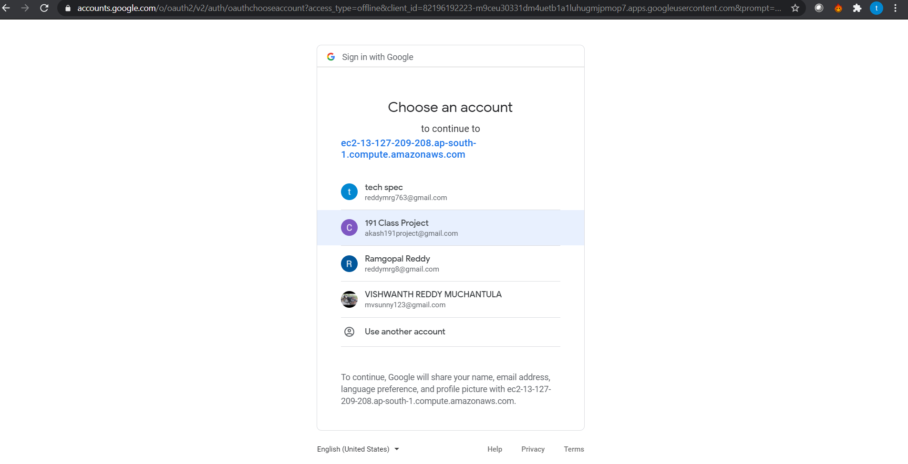

#### 2. Register and login manually

Register to the site manually by filling up the required fields & Login to the site by using your registered email address. 

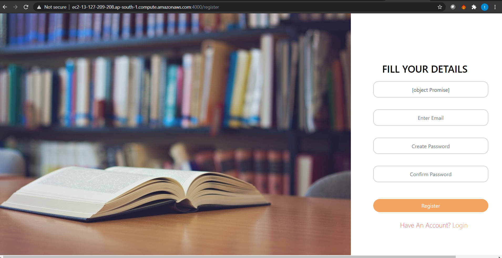

#### 3. Profile Management

Manage your profile from the app. You can upload/update your profile picture, change the old password and update the username. 

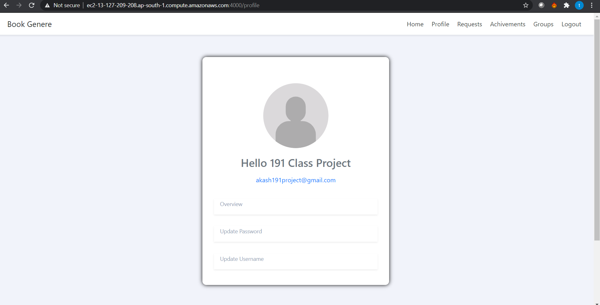

#### 4. Group Management

#### 5. Target Management

#### 6. User Management

#### 7. Posting review and verifying them.

## Prerequisites

What things you need to install the software and how to install them:

- Nodejs
- Mongodb

## Installation

A step by step series of examples that tell you how to get a development env running

### Nodejs:

- Do click on the below link to get detailed explanation on complete installation of Nodejs
- https://code.visualstudio.com/docs/nodejs/nodejs-tutorial

#### Step 1: Download Node.js Installer

In a web browser, navigate to https://nodejs.org/en/download/.
Click the Windows Installer button to download the latest default version. At the time this article was written, version 10.16.0-x64 was the latest version. The Node.js installer includes the NPM package manager. 

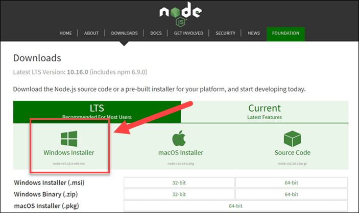

#### Step 2: Install Node.js and NPM from Browser

1. Once the installer finishes downloading, launch it. Open the downloads link in your browser and click the file. Or, browse to the location where you have saved the file and double-click it to launch.

2. The system will ask if you want to run the software – click Run.

3. You will be welcomed to the Node.js Setup Wizard – click Next.

4. On the next screen, review the license agreement. Click Next if you agree to the terms and install the software.

5. The installer will prompt you for the installation location. Leave the default location, unless you have a specific need to install it somewhere else – then click Next.

6. The wizard will let you select components to include or remove from the installation. Again, unless you have a specific need, accept the defaults by clicking Next.

7. Finally, click the Install button to run the installer. When it finishes, click Finish.

### Mongodb:

- Do click on the below link to get detailed explanation on complete installation of Nodejs
- https://docs.mongodb.com/manual/tutorial/install-mongodb-on-windows

#### Step 1:Download the installer

Download the MongoDB Community .msi installer from the following link:

[MongoDB Download Center](https://www.mongodb.com/try/download/community?tck=docs_server)

In the Version dropdown, select the version of MongoDB to download.
In the Platform dropdown, select Windows.
In the Package dropdown, select msi.
Click Download.

#### Step 2:Run the MongoDB installer.

For example, from the Windows Explorer/File Explorer:

Go to the directory where you downloaded the MongoDB installer (.msi file). By default, this is your Downloads directory.
Double-click the .msi file.

#### Step 3:Follow the MongoDB Community Edition installation wizard.

The wizard steps you through the installation of MongoDB and MongoDB Compass.

- Choose Setup Type
  You can choose either the Complete (recommended for most users) or Custom setup type. The Complete setup option installs MongoDB and the MongoDB tools to the default location. The Custom setup option allows you to specify which executables are installed and where.
- Service Configuration
  Starting in MongoDB 4.0, you can set up MongoDB as a Windows service during the install or just install the binaries.

- Select Install MongoD as a Service MongoDB as a service.

- When ready, click Install.

## Running the tests

Explain how to run the automated tests for this system
Break down into end to end tests
Explain what these tests test and why
Give an example
And coding style tests
Explain what these tests test and why
Give an example

## Deployment

• This project is deployed in real time environment using Amazon web services.
• Do follow the below steps to deploy:

1. Create a AWS account and complete the verification.
2. Create a Ec2 instance. (Hint: https://ourcodeworld.com/articles/read/977/how-to-deploy-a-node-js-application-on-aws-ec2-server ). (Hint: This project is deployed using Linux as AML).
3. Open Ec2 Instance Dashboard

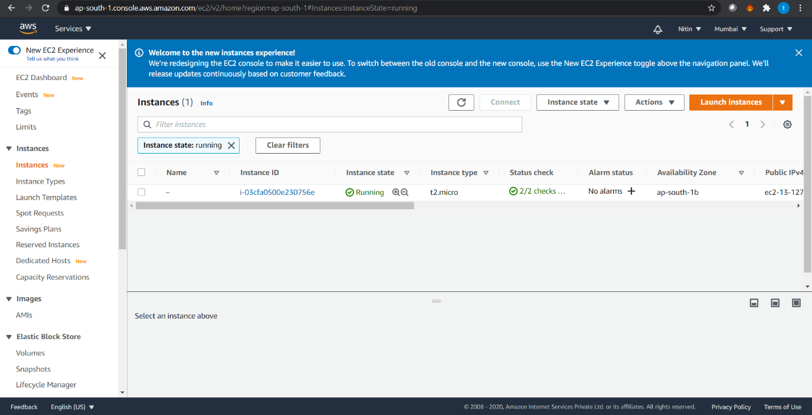

 4. Click the instance

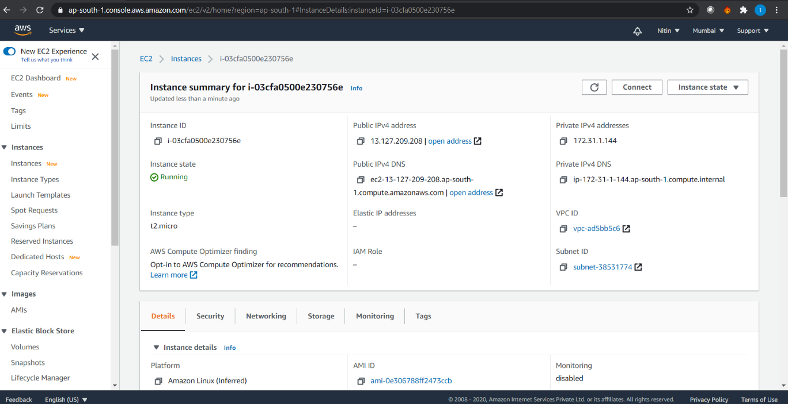

 5. Click on Connect

 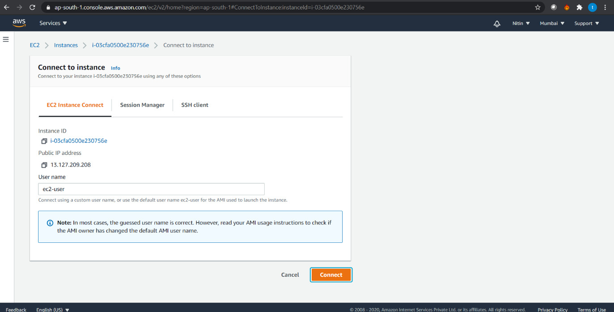

6. In the Connect to Instance Page click Connect

 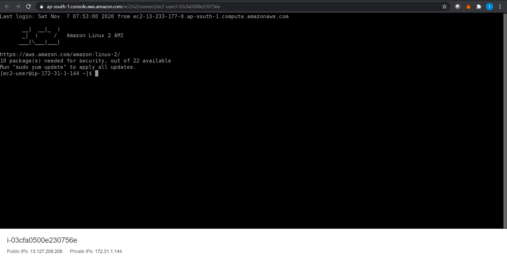

7.  A new terminal will be opened

8.  Execute “git clone https://github.com/191classproject/191classproject.git”

 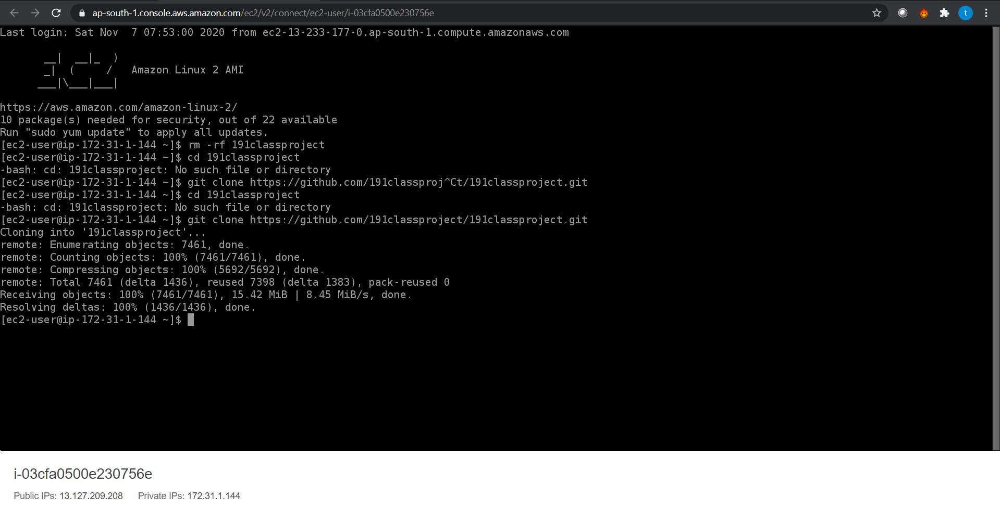

9. Change the directory by executing – “cd 191classproject”

10. Execute the following command to deploy the server – “node index.js”

 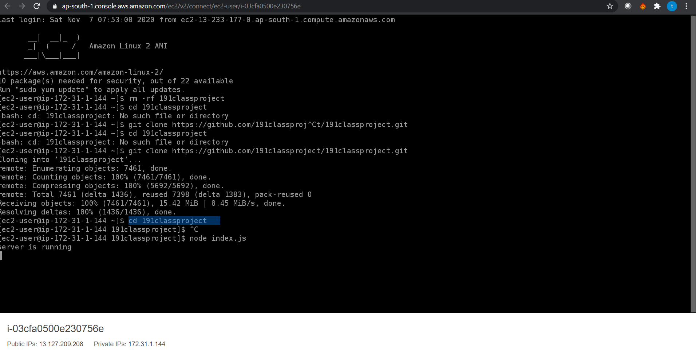

 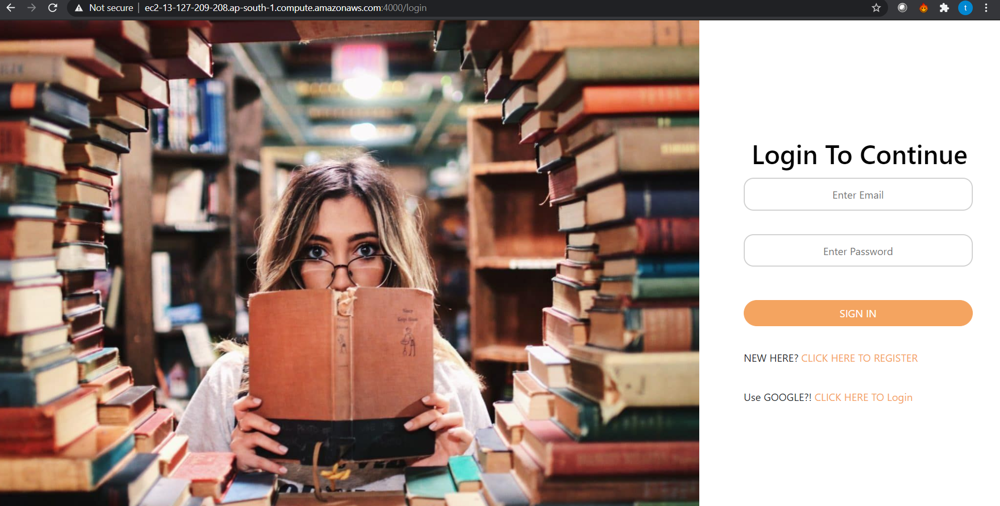

10. To deploy the project successfully , the mongo server should be online

## Built With

• Nodejs - The web framework used
• Mongodb – Database used
• AWS – To deploy

## Contributing

Please read CONTRIBUTING.md for details on our code of conduct, and the process for submitting pull requests to us.

## Author

• Akash

## License

This project is licensed under the MIT License - see the [LICENSE.md](LICENSE.md) file for details
Acknowledgments
• Google
• Inspiration
• etc

## References

1. https://docs.aws.amazon.com/efs/latest/ug/gs-step-one-create-ec2-resources.html
2. https://docs.mongodb.com/manual/tutorial/install-mongodb-on-windows
3. https://medium.com/@jackrobertscott/how-to-use-google-auth-api-with-node-js-888304f7e3a0
